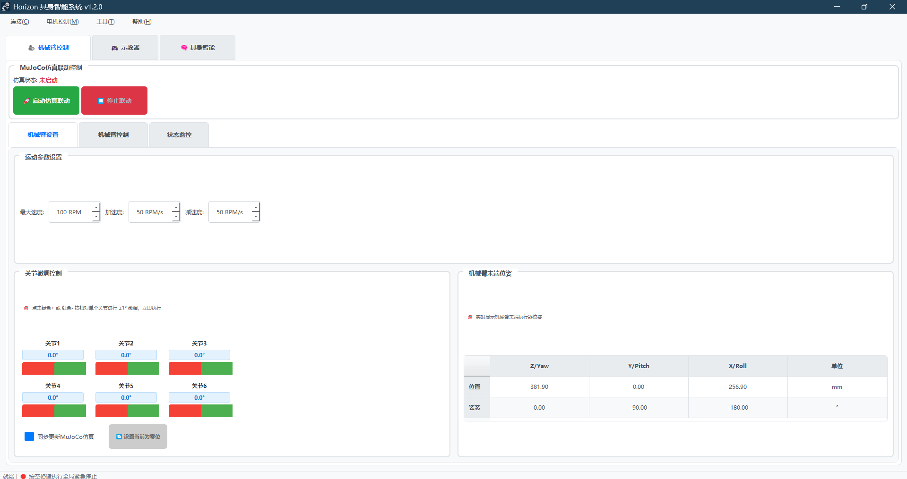

# Horizon_Arm 文档

欢迎访问 Horizon_Arm 机械臂控制上位机的文档站点。

<div align="center">
  
  <p><em>Horizon_Arm 控制系统界面</em></p>
</div>

---

## 系统简介

Horizon_Arm 是一个机械臂控制上位机系统，主要特点：

- **多种控制方式**：支持单电机控制、多电机同步、机械臂控制
- **AI集成**：集成具身智能功能，支持自然语言指令
- **仿真支持**：内置MuJoCo仿真环境
- **相机标定**：支持手眼标定和相机标定功能

---

## 使用流程

1. **环境准备** → 安装Python依赖，连接硬件设备
2. **启动系统** → 运行GUI界面，连接电机
3. **选择功能** → 根据需要选择对应的控制模式
4. **开始使用** → 执行控制指令或配置参数

---

## 文档导航

- **[快速开始](quick-start.md)** - 快速上手指南
- **[用户指南](user_guide.md)** - 详细使用说明
- **[故障排除](troubleshooting.md)** - 常见问题解决

---

## 开发者信息

本文档使用 MkDocs 构建：

```bash
# 本地预览
mkdocs serve

# 构建静态网站
mkdocs build
```