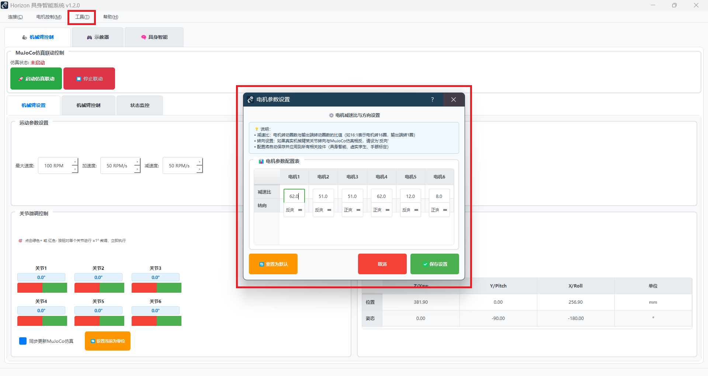

# 🔧 故障排除指南

> **快速解决使用过程中遇到的常见问题**

本页面收集了用户在使用 Horizon_Arm 过程中最常遇到的问题和解决方案。建议您先在这里查找，大部分问题都能快速解决。

<p style="color: red; font-weight: bold;">
🚨 紧急情况：任何时候按空格键可立即停止所有电机运动！
</p>

---

## 🔍 问题快速定位

| 问题类型 | 典型现象 | 跳转链接 |
|---------|---------|---------|
| 🔌 **连接问题** | 无法连接电机、串口错误 | [连接故障](#连接故障) |
| 🤖 **AI控制问题** | 指令不执行、理解错误 | [AI故障](#ai控制故障) |
| ⚙️ **电机控制问题** | 动作不准确、方向错误 | [电机故障](#电机控制故障) |
| 📷 **相机标定问题** | 标定失败、图像异常 | [标定故障](#相机标定故障) |
| 🖥️ **软件问题** | 界面卡死、崩溃退出 | [软件故障](#软件故障) |

---

## 🔌 连接故障

### ❌ 问题1：提示"无法打开串口"

**现象**：
```
❌ 无法打开串口 COM18
❌ 串口被占用或不存在
```

**原因分析**：
- 串口号错误或串口被其他程序占用
- CANable设备未正确安装驱动

**解决步骤**：
1. **检查设备管理器**：
   - 打开设备管理器
   - 查看"端口(COM和LPT)"
   - 确认CANable对应的COM口号

2. **关闭占用程序**：
   - 关闭CANgaroo、putty等串口工具
   - 重启电脑释放串口占用

3. **重新安装驱动**：
   - 下载CANable官方驱动
   - 重新安装USB转串口驱动

<div align="center">
  
  <p><em>典型的串口连接错误</em></p>
</div>

---

### ❌ 问题2：连接后提示"电机ID X 连接失败"

**现象**：
```
❌ 电机ID 3 连接失败：通信超时
✅ 已连接 5 个电机（缺少ID: 3）
```

**原因分析**：
- 电机ID设置错误或重复
- 电机未上电或CAN线接触不良
- 电机故障

**解决步骤**：
1. **检查电机ID**：
   - 使用ZDT上位机检查每个电机的ID设置
   - 确保ID为1-6且无重复

2. **检查电源和连线**：
   - 确认故障电机已上电（LED亮起）
   - 检查CAN_H、CAN_L连线是否松动

3. **单独测试**：
   - 只连接故障电机进行测试
   - 使用原厂工具验证电机功能

---

### ❌ 问题3：连接成功但无法控制

**现象**：
- 显示"已连接6个电机"
- 发送指令后电机不动作
- 无错误提示

**解决步骤**：
1. **检查使能状态**：
   - 进入"单电机控制"页面
   - 点击"使能"按钮
   - 确认电机状态为"已使能"

2. **测试基础功能**：
   - 先尝试单个关节的小角度运动
   - 确认电机方向和减速比设置正确

---

## 🤖 AI控制故障

### ❌ 问题4：输入指令后没有反应

**现象**：
- 在具身智能页面输入指令
- 点击执行后没有任何动作
- 对话框显示空白或错误

**原因分析**：
- AI服务配置错误
- 网络连接问题
- API密钥无效

**解决步骤**：
1. **检查AI配置**：
   - 打开 `config/aisdk_config.yaml`
   - 确认API密钥正确且有效
   - 检查网络连接

2. **测试AI服务**：
   ```bash
   # 运行AI测试脚本
   python example/LLM_usage.py
   ```

3. **查看错误日志**：
   - 检查控制台输出的错误信息
   - 根据错误码查找具体原因

---

### ❌ 问题5：AI理解指令错误

**现象**：
- 输入"向上抬起"，但机械臂向下运动
- 指令执行与预期完全不符

**解决步骤**：
1. **使用更清晰的指令**：
   - 避免模糊表达："抬起" → "第2关节向上转动30度"
   - 使用具体的动作描述

2. **检查电机配置**：
   - 进入"电机参数设置"
   - 确认减速比和方向设置正确

---

## ⚙️ 电机控制故障

### ❌ 问题6：机械臂动作方向错误

**现象**：
- 指令"向右"但机械臂向左
- 关节转动方向与预期相反

**解决步骤**：
1. **修改电机方向**：
   - 菜单："工具 → 电机参数设置"
   - 找到对应电机，修改方向参数（1 或 -1）
   - 保存后重新加载配置

2. **重新标定**：
   - 如果是末端位置控制问题
   - 重新进行手眼标定

<div align="center">
  
  <p><em>电机参数设置界面</em></p>
</div>

---

### ❌ 问题7：动作幅度不正确

**现象**：
- 指令"小幅度移动"但动作很大
- 角度控制不精确

**解决步骤**：
1. **检查减速比设置**：
   - 确认每个电机的减速比参数正确
   - 常见减速比：1:50, 1:100等

2. **校准零点**：
   - 使用"清零当前位置"功能
   - 重新设定机械臂初始姿态

---

## 📷 相机标定故障

### ❌ 问题8：相机无法打开

**现象**：
```
❌ 无法打开摄像头 0
❌ 相机设备不存在
```

**解决步骤**：
1. **检查相机连接**：
   - 确认USB相机已连接
   - 在设备管理器中查看"图像设备"

2. **测试相机功能**：
   - 使用Windows相机应用测试
   - 确认相机驱动正常

3. **修改相机索引**：
   - 尝试不同的相机ID（0, 1, 2...）
   - 在代码中修改camera_index参数

---

### ❌ 问题9：手眼标定精度差

**现象**：
- 标定完成但机械臂定位不准确
- 视觉坐标与实际位置偏差大

**解决步骤**：
1. **增加标定点数量**：
   - 至少采集15个不同姿态的标定点
   - 确保覆盖整个工作空间

2. **改善标定条件**：
   - 确保光照充足均匀
   - 棋盘格图案清晰无变形
   - 避免相机或机械臂抖动

<div align="center">
  
  <p><em>手眼标定操作界面</em></p>
</div>

---

## 🖥️ 软件故障

### ❌ 问题10：界面卡死或崩溃

**现象**：
- 点击按钮后界面无响应
- 程序突然关闭退出

**解决步骤**：
1. **重启程序**：
   - 关闭所有相关进程
   - 重新运行 `python run_gui.py`

2. **检查系统资源**：
   - 确保内存充足（建议8GB+）
   - 关闭其他占用资源的程序

3. **查看错误日志**：
   - 检查控制台输出
   - 查看系统事件日志

---

### ❌ 问题11：MuJoCo仿真无法显示

**现象**：
- 3D仿真窗口不出现
- 提示MuJoCo相关错误

**解决步骤**：
1. **检查MuJoCo安装**：
   ```bash
   python -c "import mujoco; print('MuJoCo安装正常')"
   ```

2. **更新显卡驱动**：
   - 下载最新的显卡驱动
   - 重启电脑

3. **使用兼容模式**：
   - 修改MuJoCo渲染设置
   - 降低渲染质量

---

## 🆘 仍然无法解决？

### 📞 获得更多帮助

1. **收集错误信息**：
   - 截图错误界面
   - 复制控制台错误信息
   - 记录操作步骤

2. **联系技术支持**：
   - 邮箱：support@horizon-arm.com
   - QQ群：123456789
   - 微信群：扫描二维码加入

3. **提交问题报告**：
   - 详细描述问题现象
   - 提供系统环境信息
   - 附上错误截图和日志

---

## 💡 预防性维护建议

### 定期检查项目
- **每周**：检查CAN线连接，清洁设备
- **每月**：更新软件版本，备份配置文件
- **每季度**：重新标定相机，检查电机磨损

### 最佳实践
- 使用前先进行仿真测试
- 定期保存重要的配置参数
- 建立操作日志记录

---

<div align="center">
  <p style="color: #2196F3; font-weight: bold;">
    💪 大部分问题都有解决方案，不要放弃！
  </p>
  <p style="color: #666;">
    如果本页面没有找到答案，请联系我们的技术支持团队
  </p>
</div>
