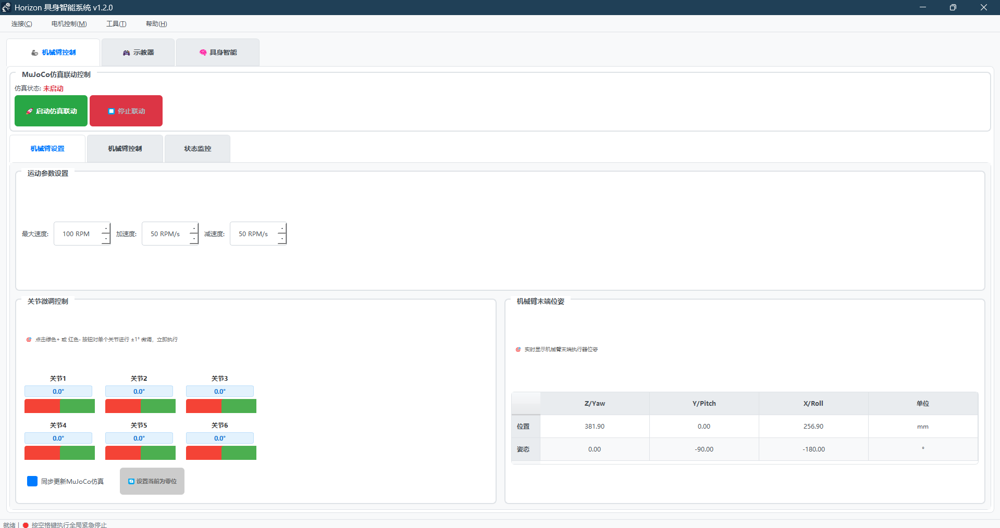
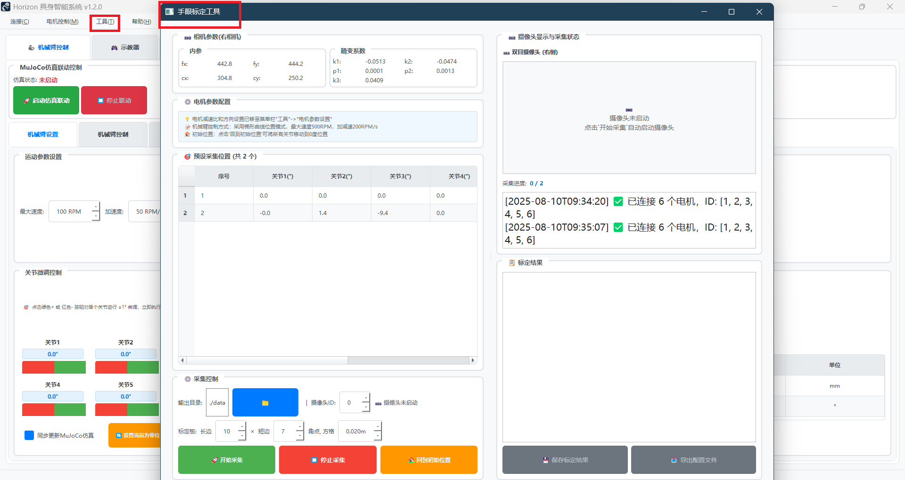

# Horizon_Arm 上位机新手使用手册

> **详细的分步操作指南，让您安全、正确地使用每一个功能**

本手册面向第一次接触本系统的用户，用"保姆级"步骤带你从安装、连接到各功能的安全使用。

<p style="color: red; font-weight: bold;">注：文档内图片可鼠标右键点击放大查看</p>

---

## 📖 使用建议

- **🚀 新手用户**：建议先阅读 [快速开始](quick-start.md) 体验核心功能
- **❓ 遇到问题**：优先查看 [故障排除](troubleshooting.md) 快速解决
- **📚 完整学习**：按顺序阅读本指南的每个章节
- **🔍 快速查找**：使用 `Ctrl+F` 搜索关键词

---
---

## 1. 我们要做什么？
- 用电脑上的图形界面（PyQt5）连接 ZDT 闭环驱动板，通过 SLCAN（串口转 CAN）控制一个或多个电机，进而控制机械臂。
- 可使用单电机、多电机同步、机械臂控制（带虚实孪生/MuJoCo）、示教器、具身智能（AI 指令）、相机/手眼标定等功能。
- 任何界面按空格键可执行全局紧急停止，优先保障安全。

---

## 2. 安装与准备

### 2.1 系统要求
- Windows 10/11（64 位）
- Python 3.8+
- USB 转 CAN 设备（如 CANable，SLCAN 协议）
- ZDT 闭环驱动板（P_Serial 设置为 CAN1_MAP）
- CAN 速率：500K

### 2.2 软件依赖
在项目根目录执行：
```bash
pip install -r requirements.txt
pip install -r Main_UI/requirements.txt
```
说明：
- 根依赖包含 MuJoCo、python-can、pyserial、AI 相关库。
- GUI 依赖在 `Main_UI/requirements.txt`，包含 PyQt5 等。

### 2.3 硬件连接
- 正确接线 CAN_H 和 CAN_L。
- 给驱动板上电，确保电机 ID 唯一（1~255）。
- 串口（如 COM8/COM18）出现在设备管理器中。

<div align="center">
  
  <p><em>设备管理</em></p>
</div>

---

## 3. 启动界面

在项目根目录运行：
```bash
python run_gui.py
```
看到窗口标题为 “Horizon 具身智能系统 v1.2.0”。
- 窗口任何位置按空格键：全局紧急停止（见第 8 节）。

<div align="center">
  
  <p><em>界面启动效果</em></p>
</div>

---

## 4. 第一次连接电机（最重要）

### 4.1 连接步骤

**1) 打开菜单"连接 → 连接电机"**

**2) 在弹出的对话框中设置：**
   - **串口**：选择实际端口，如 `COM8`
   - **波特率**：保持 `500000`（与驱动板配置一致）
   - **电机 ID**：
     - 可点"单电机(ID=1) / 双电机(1,2) / 机械臂(1..6)"快速填入
     - 或在"自定义ID"里输入，如 `1,2,3,4,5,6`

**3) 点击"确定"**
   - 系统将逐一连接每个 ID
   - 并验证能否读取状态

**4) 成功后确认：**
   - 状态栏显示"已连接 X 个电机"
   - 各功能页将接收到 `motors` 字典，可开始控制

<div align="center">
  
  <p><em>连接电机操作</em></p>
</div>

### 4.2 遇到失败时：

**常见原因：**
- 串口占用
- 波特率/CAN 速率不匹配
- 电机未上电
- ID 错误

提示会列出失败的 ID 与错误详情。

<div align="center">
  
  <p><em>常见错误-串口选错</em></p>
</div>

断开：菜单“连接 → 断开连接”。系统会断开所有电机并关闭共享接口。

---

## 5. 界面与功能导航

### 5.1 主界面布局

**标签页功能：**
- 🦾 **机械臂控制**（`DigitalTwinWidget`）
- 🎮 **示教器**（`TeachPendantWidget`）
- 🧠 **具身智能**（`EmbodiedIntelligenceWidget`）

**菜单功能（独立窗口）：**
- **单电机控制**（Ctrl+1）
- **多电机控制**（Ctrl+2）

**工具菜单：**
- **手眼标定**
- **相机标定**
- **电机参数设置**

当连接状态变化时，主窗体会把 `motors` 分发到所有功能模块，模块内会更新显示或启用控制。

<div align="center">
  
  <p><em>导航栏</em></p>
</div>

---

## 6. 单电机控制（独立窗口）
适合先验证通信与基础动作。

基本步骤：
- 菜单“电机控制 → 单电机控制”或 Ctrl+1 打开。
- 窗口中选择目标电机 ID（来自连接的 `motors`）。
- 常用操作：
  - 使能/失能
  - 停止
  - 位置控制（绝对/相对）
  - 速度控制  
  - 力矩/电流设置（如开放）
  - 读取状态（位置、速度、温度、电压、电流、到位状态等）

<div align="center">
  
  <p><em>单电机控制</em></p>
</div>

建议：先做小角度、低速度动作，确认方向/减速比设置正确。

---

## 7. 多电机控制（独立窗口）
面向同步/批量操作。窗口包含“同步控制 / 批量操作 / 循环控制 / 回零参数设置 / 状态监控”等标签。

常用场景：
- 同步控制：
  - 为多台电机设置目标（直通/梯形/速度等）。
  - 发送带同步标志命令；
  - 广播同步触发（SDK 内部通过 ID 0 广播 00 FF 66 6B）。
- 批量操作：
  - 批量使能/失能
  - 批量停止
- 循环控制：
  - 配置每台电机的动作序列，循环执行。
- 状态监控：
  - 周期读取各电机状态，显示是否在线、当前角度/速度等。

<div align="center">
  
  <p><em>多电机控制</em></p>
</div>

小贴士：
- 同步前确认所有电机已使能，且已成功读取过状态。
- 同步失败时，优先检查 ID 是否唯一、是否设置了同步标志以及是否发送了广播触发。

---

## 8. 机械臂控制（主标签：🦾 机械臂控制）
适合 6 关节机械臂（如 ID=1..6）。通常会与多电机同步配合使用。

- 更新电机：连接成功后系统自动注入 `motors`；断开则清空。
- 典型操作：
  - 关节空间：输入或调节 6 关节角，统一下发到各关节电机。
  - 末端任务：部分版本支持末端位姿到关节角的映射（取决于该控件实现）。
  - 参数重载：当“电机参数设置”修改了减速比/方向后，点击“重新加载配置”。

<div align="center">
  
  <p><em>机械臂控制部分</em></p>
</div>

注意：此页的具体控件内容较多，建议先用“单/多电机控制”验证每个关节正常，再进行整臂级控制。

---

## 9. 示教器（主标签：🎮 示教器）
用于通过模式切换（关节/基座/工具）更直观控制整臂动作。

常见能力（以当前界面为准）：
- 选择控制模式（关节/基座/工具）
- 通过滑块/按钮微调关节或末端
- 录制/回放简单动作序列
- 与“电机参数设置”联动（修改减速比/方向后记得“重新加载配置”）

<div align="center">
  
  <p><em>示教器部分</em></p>
</div>

---

## 10. 具身智能（主标签：🧠 具身智能）
通过文本或语音输入自然语言指令，系统解析并调用底层控制：
- 文本输入：输入“将关节角度设置为[0,30,-45,0,15,0]”“回到初始位置”等。
- 语音输入：开始/停止录音，识别为文本，再执行。
- 视觉问答：可结合摄像头画面进行描述、问答与播报（需硬件支持）。

<div align="center">
  
  <p><em>具身智能部分</em></p>
</div>

要点：
- 需在 `.env` 或配置中设置 AI 服务（OpenAI/通义等）密钥。
- 网络要通畅；长回复可稍有延时。

---

## 11. 相机与标定（工具菜单）
- 手眼标定：建立机械臂与相机坐标系的变换。建议采集 ≥10 个姿态，覆盖足够角度差与空间范围。
<div align="center">
  
  <p><em>手眼标定位置</em></p>
</div>
- 相机标定：获取内参与畸变系数，建议 15~20 张不同角度棋盘格图像，保证清晰与光照充足。
<div align="center">
  
  <p><em>相机标定位置</em></p>
</div>
---

## 12. 电机参数设置（工具菜单）
修改“减速比/方向”等配置。修改后：
- 打开相关控件的“重新加载配置”（如具身智能、机械臂控制、示教器）以生效。
<div align="center">
  
  <p><em>电机参数设置</em></p>
</div>
---

## 13. 数字孪生 / MuJoCo
独立脚本 `mujoco_control.py` 可启动一个简易 MuJoCo 查看器：
- 模型路径：`config/urdf/mjmodel.xml`
- 运行：
```bash
python mujoco_control.py
```
- 说明：查看器内将滑块角度（度）映射到关节位置并可视化。用于仿真预览与交互。（当前未与 GUI 实时耦合）
<div align="center">
  
  <p><em>数字孪生界面</em></p>
</div>
---

## 14. 全局安全：紧急停止（必读）
- 任意界面按空格键（Space） → 触发全局紧急停止：
  - 遍历所有已连接电机，优先 `emergency_stop()`；失败则降级 `stop()`。
  - 在输入框中按空格不会触发急停（为防误触，系统对输入控件不拦截空格）。
- 建议保留物理急停按钮，软件急停为补充。
<div align="center">
  
  <p><em>紧急停止演示</em></p>
</div>
---

## 15. 快捷键

### 15.1 连接相关
- **连接电机**：Ctrl+E
- **断开连接**：Ctrl+D

### 15.2 控制相关
- **单电机控制**：Ctrl+1
- **多电机控制**：Ctrl+2
- **全局紧急停止**：空格键（Space）

提示：F1/保存/打开等通用快捷键以你当前 Windows/编辑器为准，本程序未绑定 Esc 急停。

---

## 16. 常见问题与排查

### 16.1 连接失败/无响应

**检查项目：**
- 是否选对串口（设备管理器确认）？
- 波特率 500000、CAN 速率 500K 是否匹配？
- 电机是否上电、ID 唯一？
- 是否被其他程序占用串口（如 CANgaroo）？

### 16.2 多机同步不工作

**检查项目：**
- 是否对每台电机发送了"带同步标志"的命令？
- 是否发送了广播同步触发（ID=0，00 FF 66 6B）？
- 所有电机是否都已使能且能读取状态？

### 16.3 状态读取不稳定

**解决方法：**
- 检查 USB 线缆与接口
- 仅保留本程序占用 CAN/串口
- 降低读取频率（状态监控标签中调整）

### 16.4 位置角度异常/方向不一致

**解决方法：**
- 在"电机参数设置"里校正减速比与方向
- 小范围、低速度试动，确认后再进行大幅度动作

### 16.5 MuJoCo 运行报错

**解决方法：**
- 确认 `config/urdf/mjmodel.xml` 存在且可解析
- 按 `requirements.txt` 安装 mujoco
- 显卡/驱动兼容性问题可尝试更新

---

## 17. 参考与进阶
- SDK 文档：`Control_SDK/README.md`
- SDK 关键类：`Control_SDK/Control_Core/__init__.py` 导出 `ZDTMotorController` 与各模块
- GUI 启动：`run_gui.py`；主窗体：`Main_UI/ui/main_window.py`
- 连接控件：`Main_UI/widgets/connection_widget.py`
- 多电机控件：`Main_UI/widgets/multi_motor_widget.py`

---

祝你使用顺利，先动小角度、慢速度，多用空格急停，安全第一。 